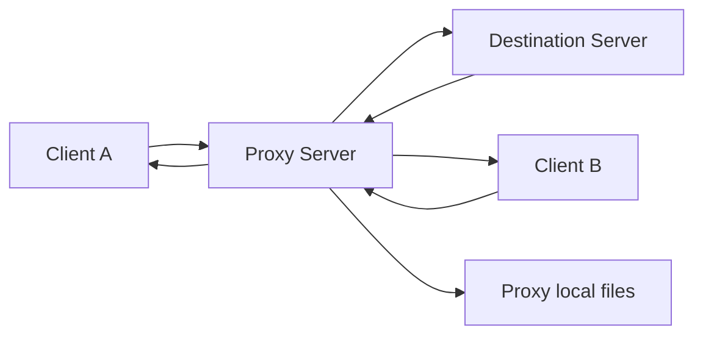

# Rechini pe fir – Proxy pentru intermedierea comunicatiei

Proiect la disciplina **Retele de Calculatoare**.

Tema implementata: **27 – Proxy pentru intermedierea comunicatiei**.

## Echipa

- Mincinoiu Dragos-Matei
- Ionescu Sabina
- Mihailescu Valter-Ioan

## Descriere

Aplicatia implementeaza un server proxy care intermediaza comunicatia intre clienti si un server destinatie.

Clientii se conecteaza la proxy si trimit cereri care contin serverul destinatie, operatia dorita si datele necesare. Proxy-ul genereaza un identificator unic pentru fiecare cerere, memoreaza asocierea dintre identificator si client, transmite cererea catre serverul destinatie si apoi livreaza raspunsul inapoi clientului corect.

Proxy-ul poate raspunde si la cereri adresate lui direct, de exemplu citirea unui fisier local dintr-un director expus.

## Functionalitati vizate

- server proxy concurent;
- un server destinatie simplu;
- cel putin doi clienti conectati la proxy;
- generare `request_id` unic pentru fiecare cerere;
- mapare `request_id -> client`;
- forward proxy -> server destinatie;
- raspuns server destinatie -> proxy -> client;
- corelarea corecta a raspunsurilor cu clientii;
- cereri directe catre proxy;
- tratarea serverului destinatie indisponibil;
- tratarea cererilor invalide;
- demo cu raspunsuri out-of-order.

## Tehnologii folosite

- Python 3
- asyncio
- TCP sockets
- JSON line-delimited protocol
- Docker
- Docker Compose
- Wireshark pentru inspectarea traficului

## Arhitectura



## Structura proiectului

```text
.
├── client/
│   └── demo_client.py
├── destination/
│   └── destination_server.py
├── proxy/
│   └── proxy_server.py
├── docs/
│   ├── project_decisions.md
│   └── tasks/
│       ├── 00-general-specs.md
│       └── 27-proxy-pentru-intermedierea-comunicatiei.md
├── docker-compose.yml
├── .gitignore
└── README.md
```

## Porturi folosite

| Componenta | Port |
|---|---:|
| Proxy server | 9000 |
| Destination server | 9101 |

## Protocol

Mesajele sunt trimise ca JSON pe o singura linie, terminate cu newline.

### Client -> Proxy

```json
{"type":"REQUEST","target":"destination","operation":"delay_echo","payload":{"text":"salut","delay_ms":2000}}
```

### Proxy -> Destination

```json
{"type":"FORWARDED_REQUEST","request_id":"uuid","operation":"delay_echo","payload":{"text":"salut","delay_ms":2000}}
```

### Destination -> Proxy

```json
{"type":"DESTINATION_RESPONSE","request_id":"uuid","status":"ok","data":{"text":"salut"}}
```

### Proxy -> Client

```json
{"type":"RESPONSE","request_id":"uuid","status":"ok","data":{"text":"salut"}}
```

### Raspuns de eroare

```json
{"type":"RESPONSE","request_id":"uuid","status":"error","error":{"code":"DESTINATION_UNAVAILABLE","message":"Server destination unavailable"}}
```

## Operatii suportate

### Operatii pe serverul destinatie

| Operatie | Descriere |
|---|---|
| `echo` | returneaza textul primit |
| `uppercase` | returneaza textul cu litere mari |
| `delay_echo` | asteapta `delay_ms`, apoi returneaza textul |

### Operatii directe pe proxy

| Operatie | Descriere |
|---|---|
| `proxy_ping` | verifica daca proxy-ul raspunde |
| `proxy_read_file` | citeste un fisier din directorul expus al proxy-ului |

## Coduri de eroare

| Cod | Descriere |
|---|---|
| `INVALID_REQUEST` | mesaj JSON invalid sau campuri lipsa |
| `UNKNOWN_OPERATION` | operatia nu este suportata |
| `DESTINATION_UNAVAILABLE` | serverul destinatie nu poate fi contactat |
| `INVALID_RESPONSE_ID` | raspunsul serverului destinatie nu contine un `request_id` valid |
| `CLIENT_DISCONNECTED` | clientul s-a deconectat inainte de primirea raspunsului |

## Cerinte de instalare

Sunt necesare:

- Python 3.10+;
- Docker;
- Docker Compose;
- optional: Wireshark pentru inspectarea traficului.

## Rulare cu Docker Compose

Din radacina proiectului:

```bash
docker compose up --build
```

Comanda porneste serviciile definite in `docker-compose.yml`.

Dupa pornire, proxy-ul este disponibil pe:

```text
localhost:9000
```

Serverul destinatie ruleaza pe:

```text
localhost:9101
```

Pentru oprire:

```bash
docker compose down
```

## Rulare client demo

In alt terminal, din radacina proiectului:

```bash
python3 client/demo_client.py
```

## Scenariu demonstrativ

Demo-ul acopera urmatoarele etape:

1. Pornirea proxy-ului si a serverului destinatie cu:

   ```bash
   docker compose up --build
   ```

2. Pornirea a doi clienti.

3. Clientul A trimite o cerere `delay_echo` cu delay mai mare.

4. Clientul B trimite o cerere `delay_echo` cu delay mai mic.

5. Raspunsul pentru Clientul B ajunge primul, desi cererea Clientului A a fost trimisa inainte.

6. Proxy-ul livreaza fiecare raspuns clientului corect folosind `request_id`.

7. Se trimite o cerere directa catre proxy, de tip `proxy_read_file`.

8. Se trimite o cerere catre un server/target invalid.

9. Proxy-ul raspunde controlat cu eroarea `DESTINATION_UNAVAILABLE`.

## Verificare cu Wireshark

Pentru inspectarea traficului, se poate folosi Wireshark cu unul dintre filtrele:

```text
tcp.port == 9000
```

sau:

```text
tcp.port == 9000 || tcp.port == 9101
```

In pachetele TCP se pot observa mesajele JSON trimise intre client, proxy si serverul destinatie, inclusiv campul `request_id`.

## Documentatie tehnica

Deciziile de arhitectura, protocolul, porturile, scenariile demo si impartirea responsabilitatilor sunt centralizate in:

```text
docs/project_decisions.md
```

Cerintele originale ale proiectului sunt pastrate in:

```text
docs/tasks/
```

## Impartirea responsabilitatilor

| Membru | Responsabilitate principala | Detalii |
|---|---|---|
| Mincinoiu Dragos-Matei | Proxy server | request_id, mapare id -> client, forward |
| Ionescu Sabina | Destination server + Docker | operatii, delay_echo, docker-compose |
| Mihailescu Valter-Ioan | Client demo + documentatie | scenarii demo, protocol, README |

## Demo live

Conform actualizarii cerintelor de seminar, proiectul va fi demonstrat live, fara video demonstrativ, folosind pasii de mai jos:

1. Pornire servicii:
```bash
docker compose up --build
```

2. Rulare client demo:
``` bash
python3 client/demo_client.py
```

3. Scenariul demonstrat:
- doi clienti conectati la proxy;
- cereri simultane catre acelasi server destinatie;
- raspunsuri out-of-order;
- corelare raspuns-client prin request_id;
- cerere directa catre proxy;
- target invalid / server destinatie indisponibil.

## Status proiect

```text
In lucru
```