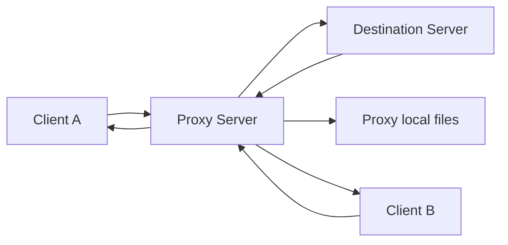

# Decizii proiect – Proxy pentru intermedierea comunicatiei

Status: Draft stabil  
Echipa: Rechini pe fir (Wiresharks ;D)
Membru 1: Mincinoiu Dragos-Matei
Membru 2: Ionescu Sabina
Membru 3: Mihailescu Valter-Ioan

---

## 1. Scopul proiectului

Proiectul implementeaza un server proxy care intermediaza comunicatia intre clienti si un server destinatie.

Clientii trimit cereri catre proxy. Proxy-ul genereaza un identificator unic pentru fiecare cerere, memoreaza asocierea dintre identificator si client, forwardeaza cererea catre serverul destinatie, apoi livreaza raspunsul inapoi clientului corect.

---

## 2. Scope MVP

### In scope

- server proxy concurent
- un server destinatie simplu
- cel putin doi clienti conectati la proxy
- cereri forwardate prin proxy
- request_id unic pentru fiecare cerere
- mapare request_id -> client
- raspunsuri corelate corect cu clientii
- cereri directe catre proxy
- tratare server destinatie indisponibil
- raspunsuri out-of-order
- rulare proxy + destination server prin Docker Compose
- client demo pentru scenariile obligatorii

### Out of scope

- HTTP proxy real
- criptare
- autentificare
- UI grafica
- persistenta complexa
- mai multe servere destinatie reale
- reconnect automat avansat
- logging avansat
- test suite extins

---

## 3. Arhitectura aleasa



---

## 4. Decizii tehnice

| Decizie          | Alegere                               | Motiv                                                 |
| ---------------- | ------------------------------------- | ----------------------------------------------------- |
| Limbaj           | Python 3                              | rapid de implementat si usor de explicat              |
| Model concurenta | asyncio                               | bun pentru conexiuni multiple fara thread-uri manuale |
| Transport        | TCP                                   | comunicare orientata pe conexiune                     |
| Format mesaje    | JSON line-delimited                   | usor de citit, testat si vazut in Wireshark           |
| ID cerere        | UUID                                  | reduce riscul de coliziuni                            |
| Proxy port       | 9000                                  | port fix pentru demo                                  |
| Destination port | 9101                                  | port fix pentru serverul destinatie                   |
| Docker           | proxy + destination in docker-compose | respecta cerinta de rulare prin Docker                |
| Client           | local, din terminal                   | mai usor de demonstrat doi clienti separati           |

---

## 5. Protocol

Toate mesajele sunt JSON-uri trimise pe o singura linie, terminate cu newline.

### Regula de colaborare

Dupa inceperea implementarii, protocolul JSON se modifica doar daca sunt de acord toti membrii echipei, deoarece afecteaza proxy-ul, serverul destinatie si clientul demo.

### 5.1 Client -> Proxy

```JSON
{"type":"REQUEST","target":"destination","operation":"delay_echo","payload":{"text":"salut","delay_ms":2000}}
```

### 5.2 Proxy -> Destination

```JSON
{"type":"FORWARDED_REQUEST","request_id":"uuid","operation":"delay_echo","payload":{"text":"salut","delay_ms":2000}}
```

### 5.3 Destination -> Proxy

```JSON
{"type":"DESTINATION_RESPONSE","request_id":"uuid","status":"ok","data":{"text":"salut"}}
```

### 5.4 Proxy -> Client

```JSON
{"type":"RESPONSE","request_id":"uuid","status":"ok","data":{"text":"salut"}}
```

### 5.5 Eroare

```JSON
{"type":"RESPONSE","request_id":"uuid","status":"error","error":{"code":"DESTINATION_UNAVAILABLE","message":"Server destination unavailable"}}
```

---

## 6. Operatii suportate
### Operatii pe destination server
| Operatie   | Descriere                                 |
| ---------- | ----------------------------------------- |
| echo       | returneaza textul primit                  |
| uppercase  | returneaza textul cu litere mari          |
| delay_echo | asteapta delay_ms, apoi returneaza textul |
### Operatii directe pe proxy
| Operatie        | Descriere                                            |
| --------------- | ---------------------------------------------------- |
| proxy_ping      | verifica daca proxy-ul raspunde                      |
| proxy_read_file | citeste un fisier din directorul expus al proxy-ului |

---

## 7. Coduri de eroare
| Cod                     | Cand apare                                         |
| ----------------------- | -------------------------------------------------- |
| INVALID_REQUEST         | mesaj JSON invalid sau campuri lipsa               |
| UNKNOWN_OPERATION       | operatia nu este suportata                         |
| DESTINATION_UNAVAILABLE | serverul destinatie nu poate fi contactat          |
| INVALID_RESPONSE_ID     | serverul destinatie raspunde fara request_id valid |
| CLIENT_DISCONNECTED     | clientul s-a deconectat inainte de raspuns         |

---

## 8. Scenarii pentru demo
1. Se porneste proiectul cu `docker compose up --build`.
2. Se porneste Client A.
3. Se porneste Client B.
4. Client A trimite `delay_echo` cu delay mare.
5. Client B trimite `delay_echo` cu delay mic
6. Se observa ca raspunsul Clientului B vine primul.
7. Se observa ca fiecare client primeste raspunsul corect pe baza request_id.
8. Se trimite o cerere directa catre proxy: `proxy_read_file`.
9. Se trimite o cerere catre un target invalid.
10. Proxy-ul returneaza eroare controlata pentru server indisponibil.

---

## 9. Impartire pe membri

| Membru | Responsabilitate principala | Livrabile | Detalii |
|---|---|---|---|
| Mincinoiu Dragos-Matei | Proxy server | `proxy/proxy_server.py`, request_id, mapare id -> client, forward, erori, cleanup | cum functioneaza proxy-ul, cum se coreleaza raspunsurile, cum sunt tratate erorile |
| Ionescu Sabina | Destination server + Docker | `destination/destination_server.py`, `docker-compose.yml`, Dockerfile-uri, operatii `echo`, `uppercase`, `delay_echo` | cum proceseaza serverul destinatie cererile si cum ruleaza serviciile in Docker |
| Mihailescu Valter-Ioan | Client demo + documentatie | `client/demo_client.py`, README, scenariu demo live, eventual pasi Wireshark | cum se ruleaza demo-ul, cum se demonstreaza doi clienti, out-of-order si server indisponibil |

---

## 10. Reguli de lucru si milestones

### 10.1 Reguli de lucru

- Protocolul JSON este contract comun intre proxy, destination server si clientul demo.
- Dupa inceperea implementarii, campurile protocolului (`type`, `target`, `operation`, `payload`, `request_id`, `status`, `data`, `error`) se modifica doar cu acordul tuturor membrilor.
- Nu se lucreaza direct pe `main`, decat pentru modificari minore de documentatie.
- Fiecare membru lucreaza pe un branch propriu:
  - `feature/proxy-core`
  - `feature/destination-docker`
  - `feature/client-demo-readme`
- Commit-urile trebuie sa fie reale si asociate cu partea lucrata de fiecare membru.

### 10.2 Primul milestone

Primul obiectiv este sa existe o integrare minima intre cele trei componente:

| Membru | Primul milestone |
|---|---|
| Mincinoiu Dragos-Matei | proxy-ul porneste si raspunde la `proxy_ping` |
| Ionescu Sabina | destination server porneste si raspunde la `echo` |
| Mihailescu Valter-Ioan | clientul trimite o cerere catre proxy si afiseaza raspunsul |

Dupa acest milestone, se leaga fluxul complet:

```text
client -> proxy -> destination -> proxy -> client
```

### 10.3 Definition of Done pe roluri

#### Proxy server – Mincinoiu Dragos-Matei

* proxy-ul porneste pe portul `9000`
* accepta mai multi clienti
* raspunde la `proxy_ping`
* raspunde la `proxy_read_file`
* genereaza `request_id` unic
* tine maparea `request_id -> client`
* forwardeaza cereri catre destination server
* livreaza raspunsul clientului corect
* intoarce eroare pentru target invalid / destination indisponibil
* curata maparile dupa raspuns sau eroare

#### Destination server + Docker – Ionescu Sabina

* destination server porneste pe portul `9101`
* citeste mesaje de tip `FORWARDED_REQUEST`
* raspunde cu mesaje de tip `DESTINATION_RESPONSE`
* pastreaza acelasi `request_id`
* implementeaza `echo`
* implementeaza `uppercase`
* implementeaza `delay_echo`
* `docker-compose.yml` porneste serviciile `proxy` si `destination`
* exista Dockerfile pentru proxy si destination

#### Client demo + documentatie – Mihailescu Valter-Ioan

* scriptul se ruleaza cu:

```bash
python3 client/demo_client.py
```

* scriptul simuleaza doi clienti logici
* demonstreaza raspunsuri out-of-order
* demonstreaza cerere directa catre proxy
* demonstreaza target invalid / server indisponibil
* README contine pasii reali de rulare
* README este actualizat dupa ce implementarea este functionala


## 11. Checklist final

- [x] Proxy porneste in Docker
- [x] Destination server porneste in Docker
- [x] Cel putin doi clienti se pot conecta
- [x] Cererile primesc request_id unic
- [x] Proxy-ul tine maparea request_id -> client
- [x] Raspunsurile sunt livrate clientului corect
- [x] Exista demo cu raspunsuri out-of-order
- [x] Exista demo cu cerere directa catre proxy
- [x] Exista demo cu server destinatie indisponibil
- [x] README contine instructiuni clare
- [x] `docker-compose.yml` contine servicii pentru proxy si destination
- [x] Exista Dockerfile pentru proxy
- [x] Exista Dockerfile pentru destination
- [x] README nu mai contine referinte la video, doar la demo live

