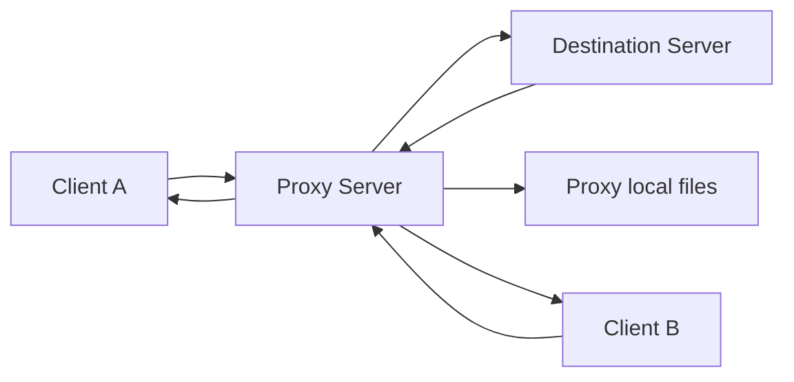

# Decizii proiect – Proxy pentru intermedierea comunicatiei

Status: Draft stabil  
Echipa: Rechini pe fir (Wiresharks ;D)
Membru 1: Mincinoiu Dragos-Matei
Membru 2: Ionescu Sabina
Membru 3: Mihailescu Valter-Ioan

---

## 1. Scopul proiectului

Proiectul implementeaza un server proxy care intermediaza comunicatia intre clienti si un server destinatie.

Clientii trimit cereri catre proxy. Proxy-ul genereaza un identificator unic pentru fiecare cerere, memoreaza asocierea dintre identificator si client, forwardeaza cererea catre serverul destinatie, apoi livreaza raspunsul inapoi clientului corect.

---

## 2. Scope MVP

### In scope

- server proxy concurent
- un server destinatie simplu
- cel putin doi clienti conectati la proxy
- cereri forwardate prin proxy
- request_id unic pentru fiecare cerere
- mapare request_id -> client
- raspunsuri corelate corect cu clientii
- cereri directe catre proxy
- tratare server destinatie indisponibil
- raspunsuri out-of-order
- rulare proxy + destination server prin Docker Compose
- client demo pentru scenariile obligatorii

### Out of scope

- HTTP proxy real
- criptare
- autentificare
- UI grafica
- persistenta complexa
- mai multe servere destinatie reale
- reconnect automat avansat
- logging avansat
- test suite extins

---

## 3. Arhitectura aleasa



---

## 4. Decizii tehnice

| Decizie          | Alegere                               | Motiv                                                 |
| ---------------- | ------------------------------------- | ----------------------------------------------------- |
| Limbaj           | Python 3                              | rapid de implementat si usor de explicat              |
| Model concurenta | asyncio                               | bun pentru conexiuni multiple fara thread-uri manuale |
| Transport        | TCP                                   | comunicare orientata pe conexiune                     |
| Format mesaje    | JSON line-delimited                   | usor de citit, testat si vazut in Wireshark           |
| ID cerere        | UUID                                  | reduce riscul de coliziuni                            |
| Proxy port       | 9000                                  | port fix pentru demo                                  |
| Destination port | 9101                                  | port fix pentru serverul destinatie                   |
| Docker           | proxy + destination in docker-compose | respecta cerinta de rulare prin Docker                |
| Client           | local, din terminal                   | mai usor de demonstrat doi clienti separati           |

---

## 5. Protocol

Toate mesajele sunt JSON-uri trimise pe o singura linie, terminate cu newline.

### 5.1 Client -> Proxy

```JSON
{"type":"REQUEST","target":"destination","operation":"delay_echo","payload":{"text":"salut","delay_ms":2000}}
```

### 5.2 Proxy -> Destination

```JSON
{"type":"FORWARDED_REQUEST","request_id":"uuid","operation":"delay_echo","payload":{"text":"salut","delay_ms":2000}}
```

### 5.3 Destination -> Proxy

```JSON
{"type":"DESTINATION_RESPONSE","request_id":"uuid","status":"ok","data":{"text":"salut"}}
```

### 5.4 Proxy -> Client

```JSON
{"type":"RESPONSE","request_id":"uuid","status":"ok","data":{"text":"salut"}}
```

### 5.5 Eroare

```JSON
{"type":"RESPONSE","request_id":"uuid","status":"error","error":{"code":"DESTINATION_UNAVAILABLE","message":"Server destination unavailable"}}
```

---

## 6. Operatii suportate
### Operatii pe destination server
| Operatie   | Descriere                                 |
| ---------- | ----------------------------------------- |
| echo       | returneaza textul primit                  |
| uppercase  | returneaza textul cu litere mari          |
| delay_echo | asteapta delay_ms, apoi returneaza textul |
### Operatii directe pe proxy
| Operatie        | Descriere                                            |
| --------------- | ---------------------------------------------------- |
| proxy_ping      | verifica daca proxy-ul raspunde                      |
| proxy_read_file | citeste un fisier din directorul expus al proxy-ului |

---

## 7. Coduri de eroare
| Cod                     | Cand apare                                         |
| ----------------------- | -------------------------------------------------- |
| INVALID_REQUEST         | mesaj JSON invalid sau campuri lipsa               |
| UNKNOWN_OPERATION       | operatia nu este suportata                         |
| DESTINATION_UNAVAILABLE | serverul destinatie nu poate fi contactat          |
| INVALID_RESPONSE_ID     | serverul destinatie raspunde fara request_id valid |
| CLIENT_DISCONNECTED     | clientul s-a deconectat inainte de raspuns         |

---

## 8. Scenarii pentru demo
1. Se porneste proiectul cu `docker compose up --build`.
2. Se porneste Client A.
3. Se porneste Client B.
4. Client A trimite `delay_echo` cu delay mare.
5. Client B trimite `delay_echo` cu delay mic
6. Se observa ca raspunsul Clientului B vine primul.
7. Se observa ca fiecare client primeste raspunsul corect pe baza request_id.
8. Se trimite o cerere directa catre proxy: `proxy_read_file`.
9. Se trimite o cerere catre un target invalid.
10. Proxy-ul returneaza eroare controlata pentru server indisponibil.

---

## 9. Impartire pe membri

| Membru   | Responsabilitate principala | Detalii                |
| -------- | --------------------------- | ---------------------------------------- |
| Membru 1 | Proxy server                | request_id, mapare id -> client, forward |
| Membru 2 | Destination server + Docker | operatii, delay_echo, docker-compose     |
| Membru 3 | Client demo + documentatie  | scenarii demo, protocol, README          |

---

## 10. Checklist final

- [ ] Proxy porneste in Docker
- [ ] Destination server porneste in Docker
- [ ] Cel putin doi clienti se pot conecta
- [ ] Cererile primesc request_id unic
- [ ] Proxy-ul tine maparea request_id -> client
- [ ] Raspunsurile sunt livrate clientului corect
- [ ] Exista demo cu raspunsuri out-of-order
- [ ] Exista demo cu cerere directa catre proxy
- [ ] Exista demo cu server destinatie indisponibil
- [ ] README contine instructiuni clare


